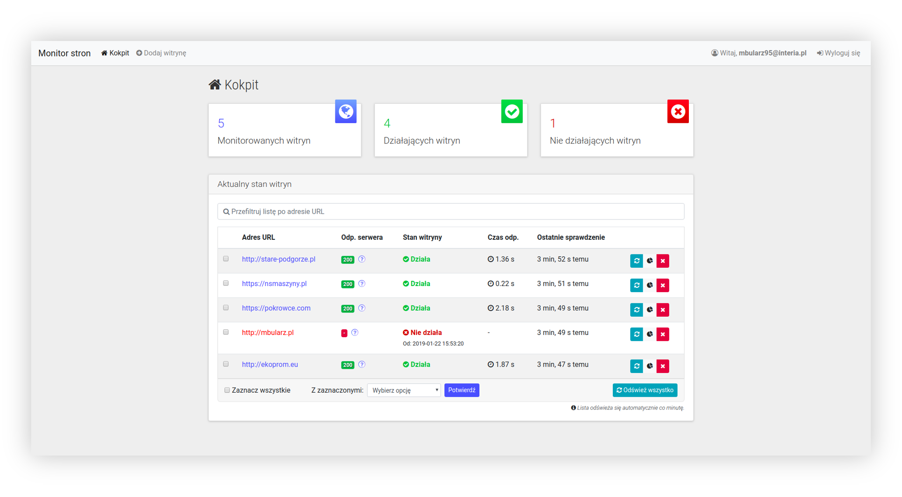
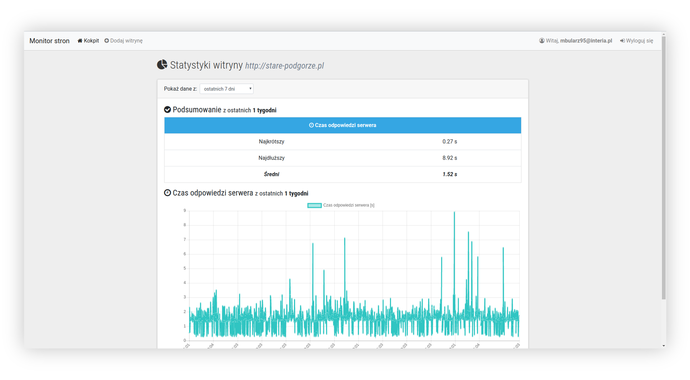

# Web Alert - Website Monitor (front-end)

This is a front-end part of Web Alert application.

## General info

This project provides a web dashboard for monitoring your websites health using HTTP server response. It communicates with API server.

## Main features

The app provides functionalities such as:

- Overall overview of monitored websites status (indicators, list of websites)
- Refreshing website (or websites) status on demand
- Highlight websites which are down
- Add and remove websites from list
- Give basic stats (like server response time chart) for chosen website
- Automatic refreshing data every 1 minute
- Filtering list of monitored websites by URL address in real time
- Sign-in & Sing-up with Google ReCaptcha

## Technologies

Project is created with:

- React 15
- React Router
- Flux
- JWT
- Reactstrap
- Sass
- Chart.js
- Axios
